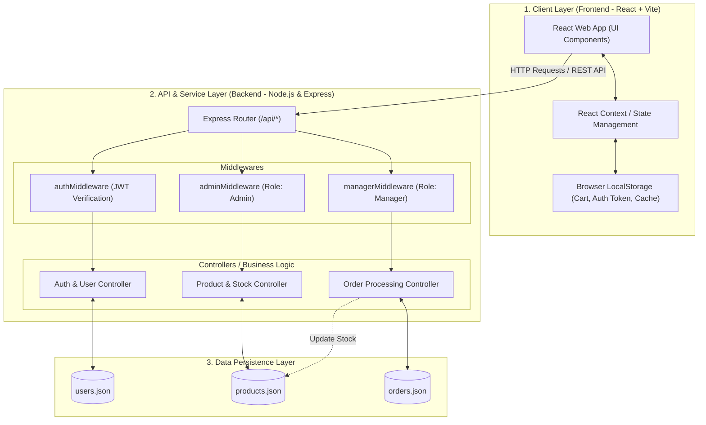

# I HAVE COMPUTER

---

# Table of Contents

- [1. ผู้มีส่วนร่วม (Contributors)](#1-ผู้มีส่วนร่วม-contributors)
- [2. หลักการและเหตุผล (Rationale)](#2-หลักการและเหตุผล-rationale)
- [3. วัตถุประสงค์ของโครงงาน (Objectives)](#3-วัตถุประสงค์ของโครงงาน-objectives)
- [4. ขอบเขตของระบบ (System Scope)](#4-ขอบเขตของระบบ-system-scope)
- [5. แนวทางของการพัฒนาตาม SDLC](#5-แนวทางของการพัฒนาตาม-sdlc)
- [6. Tech Stack](#6-tech-stack)
- [7. แนวทางการทดสอบ (Testing Approach)](#7-แนวทางการทดสอบ-testing-approach)
- [8. ผลลัพธ์ที่คาดว่าจะได้รับ (Expected Outcomes)](#8-ผลลัพธ์ที่คาดว่าจะได้รับ-expected-outcomes)
- [9. แผนการดำเนินงาน 4 สัปดาห์ (Work Plan)](#9-แผนการดำเนินงาน-4-สัปดาห์-work-plan)
- [10. Requirement](#10-requirement)
- [11. User Personas](#11-user-personas)
- [12. Use Case Diagram](#12-use-case-diagram)
- [13. Class Diagram](#13-class-diagram)
- [14. Data Schema](#14-data-schema)
- [15. Sequence Diagrams](#15-sequence-diagrams)
- [16. Wireframe](#16-wireframe)
- [17. Prototype](#17-prototype)
- [18. System Architecture](#18-system-architecture)
- [19. User Acceptance Testing](#19-UAT-User-Acceptance-Testing)

---

# 1. ผู้มีส่วนร่วม (Contributors)

| Name | Student ID | Role | GitHub |
|------|------------|------|--------|
| Name | 67162090   | Project Manager | @Supphanat-P |
| Name | 67081836 | Frontend / Backend | @Theepakorn-T |
| Name | 67160778 | Frontend / Backend  | @Theeradon-map |
| Name | 67178272 | Frontend / Backend | @Chinnaphat-ppsadzy |
| Name | 67158596 | Frontend / Backend | @Peeraphong-Taz |

---

# 2. หลักการและเหตุผล (Rationale)

- โครงงานนี้จัดทำขึ้นเพื่อพัฒนาแพลตฟอร์ม e-Commerce ร้านจำหน่ายอุปกรณ์คอมพิวเตอร์ออนไลน์ที่ช่วยให้ผู้ซื้อสามารถ ค้นหาสินค้าที่ต้องการ และสั่งซื้อสินค้าได้ตลอด 24 ชั่วโมง
  โดยตัวระบบ มุ่งเน้นการบูรณการเทคโนโลยี React , Node.js และ Local Storage เพื่ออำนวยความสะดวกแก่ผู้ใช้งาน พร้อมทั้งมีระบบหลังบ้านที่ช่วยให้ผู้บริหารจัดการข้อมูลสินค้าและควบคุมคลังสต็อกได้อย่างถูกต้อง แม่นยำ และมีประสิทธิภาพ

---

# 3. วัตถุประสงค์ของโครงงาน (Objectives)

1. เพื่อศึกษาและประยุกต์ใช้กรอบแนวคิดดิจิตัลแพลตฟอร์ม เว็บแอปพลิเคชั่นเฟรมเวิร์ก และเครื่องมือสมัยใหม่ในการพัฒนาระบบร้านจำหน่ายอุปกรณ์คอมพิวเตอร์ ได้อย่างมีประสิทธิภาพ

2. เพื่อพัฒนาระบบจัดการฟังก์ชันหลักของ e-Commerce เช่น ระบบตะกร้าสินค้า ระบบค้นหา และระบบแบ่งสิทธิ์การใช้งานตามบทบาทผู้ใช้ ได้อย่างถูกต้อง

3. เพื่อศึกษาและฝึกฝนการทำงานร่วมกันเป็นทีม 

---

# 4. ขอบเขตของระบบ (System Scope)

- ล็อคอิน / สมัครสมาชิก
- การค้นหาสินค้า
- การดูรายละเอียดสินค้า
- การจัดการตะกร้าสินค้า
- ระบบสั่งซื้อสินค้า
- ระบบชำระเงิน
- ระบบจัดการข้อมูลสินค้า
- ดูประวัติการสั่งซื้อ
- จัดการสถานะการขนส่ง
- จัดการสินค้า
- จัดการผู้ใช้
- รายงานภาพรวม

## User Roles

| Role |
|------|
| Customer | 
| Manager |
| Admin |

---

# 5. แนวทางของการพัฒนาตาม SDLC

## SDLC Model

### Phase 1 - Planning

- ประชุมวางแผนกำหนดขอบเขตระบบ แบ่งหน้าที่รับผิดชอบของสมาชิกทั้ง 5 คน และกำหนดกรอบเวลา

### Phase 2 - Analysis

- วิเคราะห์ความต้องการระบบ รวบรวมข้อมูลจำเพาะของอุปกรณ์คอมพิวเตอร์ และพฤติกรรมการซื้อของผู้ใช้

### Phase 3 - Design

- ออกแบบสถาปัตยกรรมข้อมูล โครงสร้างระบบแผนภาพ Flowchart ด้วย Draw.io และออกแบบหน้าจอติดต่อผู้ใช้ (UI/UX) ด้วย Figma

### Phase 4 - Development

- เขียนโปรแกรมฝั่ง Frontend ด้วย React และ Tailwind CSS เชื่อมต่อกับ Backend Node.js และจัดการข้อมูลผ่าน Local Storage

### Phase 5 - Testing

- ดำเนินการทดสอบระบบผ่านเครื่องมือ Postman ทำ Manual Testing และ UAT ตรวจสอบบั๊กและแก้ไขลอจิกให้ถูกต้องตามเงื่อนไข

### Phase 6 - Deployment

- จัดเตรียมโครงสร้างแพลตฟอร์มเพื่อส่งมอบโครงงานบูรณาการระบบหน้าบ้านและหลีงบ้าน ให้ทำงานร่วมกันอย่างสมบูรณ์

### Phase 7 - Maintenance

- สรุปผลการพัฒนา ตรวจสอบเสถียรภาพของการจัดเก็บข้อมูล ใน Local Storage และจัดทำเอกสารประกอบรายงาน

---

# 6. Tech Stack

## Frontend

- REACT VITE
- TAILSWIND CSS
- Chart js
- axios
- Library etc.

## Backend

- Node js
- express js
- cors js
- bcrypt js
- etc.

## Database

- Local Storage
- json file Storage

## DevOps

- GitHub Actions

## Tools

- Figma
- Postman
- VS Code
- Git Desktop
- Manual Testing

---

# 7. แนวทางการทดสอบ (Testing Approach)

## Testing Types

- Functional Testing
- API Testing
- User Acceptance Testing (UAT)

---

# 8. ผลลัพธ์ที่คาดว่าจะได้รับ (Expected Outcomes)

1. ได้เว็บแอปพลิเคชันระบบร้านจำหน่ายอุปกรณ์คอมพิวเตอร์ ที่ฟังก์ชันการทำงานตรงตามขอบเขต และ เสถียรภาพสูง

2. เข้าใจกระบวนการทำและเลือกใช้เทคโนโลยีเว็บแอปพลิเคชัน (React, Node.js, Local Storage) ตลอดจนการจัดการสิทธิ์ User Roles

3. สมาชิกในกลุ่มเข้าใจกระบวนการทำงานร่วมกัน ผ่าน GitHub และการพัฒนาซอฟต์แวร์อย่างเป็นระบบตามหลัก SDLC ทั้ง 7 ขั้นตอน

4. มีเอกสารสรุปผลการทดสอบระบบ (Test Report) จาก Postman และ Manual Testing ที่สามารถนำไปใช้เป็นประวัติการพัฒนาซอฟต์แวร์ได้

---

# 9. แผนการดำเนินงาน 4 สัปดาห์ (Work Plan)

| Week | Tasks | Status |
|------|-------|--------|
| Week 1 | วิเคราะห์และออกแบบระบบ | ประชุมกลุ่มสรุปฟังก์ชันที่ต้องการ, วาด Flowchart ระบบด้วย Draw.io และออกแบบ Wireframe/UI Prototype ทุกหน้าด้วย Figma |
| Week 2 | พัฒนา Frontend | ขึ้นฟอร์ม โครงสร้างโปรเจกต์ เขียนโค้ดหน้าจอผู้ใช้ด้วย React และจัดหน้าตาด้วย Tailwind CSS ให้รองรับระบบค้นหาและระบบตะกร้า |
| Week 3 | พัฒนา Backend และ ฐานข้อมูล | เขียนระบบประมวลผลฝั่งหลังบ้านด้วย Node.js พัฒนา RESTful API และเขียนเงื่อนไขการเรียกใช้ข้อมูลแบบ Client-Side ผ่าน Local Storage |
| Week 4 | ทดสอบและนำเสนอผลงาน | ทำ API Testing ด้วย Postman ทำการทดสอบ Functional & UAT ด้วย Manual Testing ตรวจสอบความถูกต้อง เก็บตกบั๊ก และจัดเตรียมสไลด์นำเสนอโครงการ |

---

# 10. Requirement

## Functional Requirements

- **ลูกค้า (Customers)**
    - **สมัครสมาชิก/เข้าสู่ระบบ (Register/Login)** — ผู้ใช้สามารถสร้างบัญชีใหม่หรือเข้าสู่ระบบด้วยบัญชีที่มีอยู่แล้ว เพื่อเข้าถึงฟีเจอร์ต่าง ๆ ของระบบ
    - **เรียกดูสินค้า (Browse Products)** — ผู้ใช้สามารถดูรายการสินค้าทั้งหมดที่มีในระบบ พร้อมรายละเอียดและราคา
    - **เพิ่มสินค้าลงตะกร้า (Add to Cart)** — ผู้ใช้สามารถเลือกสินค้าที่ต้องการและเพิ่มลงในตะกร้าสินค้าเพื่อเตรียมสั่งซื้อ
    - **ชำระเงิน (Checkout)** — ผู้ใช้สามารถดำเนินการสั่งซื้อและชำระเงินสำหรับสินค้าที่อยู่ในตะกร้า
    - **ดูประวัติการสั่งซื้อ (View Order History)** — ผู้ใช้สามารถตรวจสอบรายการสั่งซื้อที่ผ่านมาทั้งหมด พร้อมสถานะของแต่ละคำสั่งซื้อ
    - **ค้นหาสินค้า (Search Products)** — ผู้ใช้สามารถค้นหาสินค้าด้วยคำค้นหา เพื่อหาสินค้าที่ต้องการได้อย่างรวดเร็ว
    - **ดูรายละเอียดสินค้า (View Product Details)** — ผู้ใช้สามารถดูข้อมูลรายละเอียดของสินค้าแต่ละชิ้น เช่น คำอธิบาย ราคา และรูปภาพ
- **ผู้จัดการ (Manager)**
    - **จัดการสินค้า (Manage Products)** — ผู้จัดการสามารถเพิ่ม แก้ไข หรือลบสินค้าในระบบ รวมถึงอัปเดตข้อมูลสินค้าต่าง ๆ
    - **จัดการคำสั่งซื้อ (Manage Orders)** — ผู้จัดการสามารถดูรายการคำสั่งซื้อทั้งหมดและอัปเดตสถานะคำสั่งซื้อ (เช่น กำลังจัดส่ง, จัดส่งแล้ว)
- **ผู้ดูแลระบบ (Admin)**
    - **จัดการผู้ใช้ (Manage Users)** — ผู้ดูแลระบบสามารถดู แก้ไข หรือลบบัญชีผู้ใช้ในระบบ
    - **จัดการบทบาท (Manage Roles)** — ผู้ดูแลระบบสามารถกำหนดหรือเปลี่ยนแปลงบทบาทของผู้ใช้ (เช่น ลูกค้า, ผู้จัดการ, ผู้ดูแลระบบ)


## Non-functional Requirements

- Performance
- Security
- Reliability
- Scalability
- Availability

---

# 11. User Personas

## 1. ลูกค้า (Customer)

### นายกิตติภพ (นนท์) | อายุ 21 ปี
> *"ผมต้องการเว็บบอร์ดหรือหน้าร้านออนไลน์ที่บอกสเปคคอมอย่างละเอียด ชำระเงินง่าย ไม่ซับซ้อน"*

*   **อาชีพ:** นักศึกษาคณะเทคโนโลยีสารสนเทศ และเป็นเกมเมอร์
*   **บริบทและพฤติกรรม:** นนท์ชอบประกอบคอมพิวเตอร์และอัปเกรดอุปกรณ์อยู่เสมอ เขามักจะค้นหาข้อมูลสเปคคอมพิวเตอร์เชิงลึกก่อนตัดสินใจซื้อ และชอบความสะดวกรวดเร็วในการสั่งซื้อผ่านเว็บไซต์เพราะไม่มีเวลาไปเดินเลือกที่หน้าร้าน
*   **เป้าหมายในการใช้ระบบ (Goals):**
    *   ต้องการค้นหาและเปรียบเทียบสเปคอุปกรณ์คอมพิวเตอร์ (เช่น CPU, การ์ดจอ, RAM) ได้อย่างละเอียดและถูกต้อง
    *   อยากได้ระบบตะกร้าสินค้าที่ใช้งานง่าย สามารถเลือกสินค้าไว้ก่อนแล้วค่อยกดชำระเงินทีเดียวได้
    *   ต้องการดูประวัติการสั่งซื้อย้อนหลังเพื่อเช็ครายการสินค้าที่เคยซื้อไป
*   **จุดเจ็บปวด (Pain Points):**
    *   เว็บไซต์ทั่วไปมักแสดงรายละเอียดสินค้าไม่ครบถ้วน ทำให้ตัดสินใจยาก
    *   ขั้นตอนการสั่งซื้อและชำระเงินที่ซับซ้อนเกินไปอาจทำให้ล้มเลิกความตั้งใจในการซื้อ

---

## 2. ผู้ดูแลระบบ (Administrator)

### นายอภิสิทธิ์ (เก่ง) | อายุ 28 ปี
> *"ระบบหลังบ้านต้องอัปเดตง่าย ล็อกอินปลอดภัย และไม่ทำให้ข้อมูลสินค้าผิดพลาด"*

*   **อาชีพ:** เจ้าหน้าที่ไอทีและผู้ดูแลระบบ (IT Support & Admin)
*   **บริบทและพฤติกรรม:** เก่งมีความเชี่ยวชาญด้านคอมพิวเตอร์และระบบหลังบ้าน หน้าที่หลักของเขาคือการดูแลความเรียบร้อยของเว็บไซต์ และคอยอัปเดตข้อมูลสินค้าทุกครั้งที่มีโมเดลใหม่ ๆ หรืออุปกรณ์ไอทีล็อตใหม่เข้ามาในคลัง
*   **เป้าหมายในการใช้ระบบ (Goals):**
    *   ต้องการระบบจัดการข้อมูลสินค้า (เพิ่ม, ลบ, แก้ไข) ที่เสถียรและทำงานได้รวดเร็ว เพื่อให้ข้อมูลหน้าเว็บอัปเดตเป็นปัจจุบันที่สุด
    *   ต้องการจัดการสิทธิ์และเข้าถึงส่วนควบคุมระบบหลังบ้านได้อย่างปลอดภัย
*   **จุดเจ็บปวด (Pain Points):**
    *   ฟอร์มกรอกข้อมูลสินค้าหลังบ้านที่ใช้งานยาก หรือไม่มีการจัดหมวดหมู่ที่ดี ทำให้ใช้เวลาในการอัปเดตสต็อกนาน
    *   หากระบบการจัดการข้อมูล (ผ่าน Local Storage) ทำงานผิดพลาด อาจทำให้ราคาหรือรายละเอียดสินค้าหน้าเว็บแสดงผลไม่ตรงกับความเป็นจริง

---

## 3. ผู้จัดการ (Manager)

### คุณสมศักดิ์ | อายุ 45 ปี
> *"ผมต้องการเห็นภาพรวมของยอดขายและประวัติการสั่งซื้อเพื่อนำไปวางแผนสต็อกสินค้า"*

*   **อาชีพ:** เจ้าของร้านและผู้จัดการร้าน "I have Computer"
*   **บริบทและพฤติกรรม:** คุณสมศักดิ์เป็นผู้บริหารที่เน้นดูภาพรวมของธุรกิจ เขาไม่ได้ลงรายละเอียดเรื่องการโค้ดหรือการกรอกข้อมูลสินค้าด้วยตัวเอง แต่สนใจเรื่องยอดขาย รายการคำสั่งซื้อ และพฤติกรรมการซื้อของลูกค้าเพื่อนำไปวางแผนธุรกิจและสั่งของมาเติมในโกดัง
*   **เป้าหมายในการใช้ระบบ (Goals):**
    *   ต้องการเข้าดูประวัติการสั่งซื้อทั้งหมดของลูกค้าในระบบเพื่อตรวจสอบสถานะการชำระเงินและยอดขาย
    *   ต้องการระบบที่ช่วยควบคุมและตรวจสอบการทำงานของแอดมินในการจัดการสินค้าได้
*   **จุดเจ็บปวด (Pain Points):**
    *   การไม่สามารถตรวจสอบประวัติคำสั่งซื้อที่ชัดเจนได้ ทำให้ยากต่อการตรวจสอบบัญชีและสรุปยอดขายประจำเดือน
    *   ระบบที่ไม่มีการแยกสิทธิ์ (Roles) ที่ชัดเจน อาจทำให้พนักงานทั่วไปเข้าถึงข้อมูลสำคัญทางธุรกิจได้

---

# 12. Use Case Diagram

## User Diagram


## Manager Diagram


## Admin Diagram


---

# 13. Class Diagram

<!-- ## Diagram Image
 -->

```mermaid
classDiagram
    class User {
        +string id
        +string name
        +string email
        +string password
        +string phone
        +string birthDate
        +string role
        +register(userData) User
        +login(email, password) Token
        +updateProfile(profileData) void
    }

    class Customer {
        +string cusId 
        +addToCart(product, quantity) void
        +removeFromCart(productId) void
        +checkout(orderDetails) Order
        +viewOrderHistory() Array~Order~
    }

    class Manager {
        +string mngId
        +getAllOrders() Array~Order~
        +updateOrderStatus(orderId, status) void
        +createProduct(productData) Product
        +updateProduct(productId, productData) void
        +deleteProduct(productId) void
    }

    class Admin {
        +string admId
        +getAllOrders() Array~Order~
        +createProduct(productData) void
        +updateProduct(productId, productData) void
        +deleteProduct(productId) void
        +manageUserRole(userId, newRole) void
		+deleteUser(userId) : void
        +viewsReport() Object
    }

    class Product {
        +number productId
        +string name
        +string brand
        +number price
        +number stock
        +string image
        +string description
        +string category
        +Array~string~ highlights
        +Object attributes
        +Object attributesDetails
        +checkStock(quantity) void
        +deductStock(quantity) void
        +updateInfo(data) void
    }

    class Order {
        +string orderId
        +string date
        +Array~OrderItem~ items
        +number total
        +string status
        +string shippingAddress
        +string recipientName
        +string recipientPhone
        +string paymentMethod
        +string userId
        +calculateTotal() number
        +updateStatus(newStatus) void
        +getSummary() Object
    }

    class OrderItem {
        +number productId
        +string name
        +string brand
        +number price
        +number quantity
        +string image
        +getSubtotal() number
    }

    class Cart {
		+string cartId
        +Array~CartItem~ items
        +addItem(product, qty) void
        +removeItem(productId) void
        +updateQuantity(productId, qty) void
        +clearCart() void
        +getTotalPrice() number
    }

    class CartItem {
        +number productId
        +string name
        +string brand
        +number price
        +number quantity
        +string image
        +calculateSubtotal() number
    }

    class Address {
        +string id
        +string provice
        +string district
        +string sdistrict
        +number postalcode
        +string addressDetail
        +boolean isDefault
        +updateAddress() : void
        +addAddress() : void
    }

    User <|-- Customer
    User <|-- Manager
    User <|-- Admin

    Customer "1" -- "0..*" Order : 
    Customer "1" -- "1" Cart : 
    Order "1" *-- "1..*" OrderItem : 
    Cart "1" *-- "0..*" CartItem : 
    OrderItem "0..*" -- "1" Product :  
    CartItem "0..*" -- "1" Product :  
    Address "0..*" -- "1" Customer :  


```

### Entity Functions & Methods Detail

1. **User & Role Entities (`User`, `Customer`, `Manager`, `Admin`)**
   - `register(userData)`: ตรวจสอบอีเมลซ้ำ เข้ารหัสรหัสผ่านด้วย bcrypt และบันทึกข้อมูลผู้ใช้ใหม่
   - `login(email, password)`: ตรวจสอบข้อมูลประจำตัวและออก JWT Access Token สำหรับเข้าสู่ระบบ
   - `updateProfile(profileData)`: อัปเดตข้อมูลส่วนตัว เช่น ชื่อ เบอร์โทรศัพท์ วันเดือนปีเกิด
   - `addToCart(product, quantity)`: เพิ่มสินค้าเข้าตะกร้าสินค้า
   - `checkout(orderDetails)`: สร้างคำสั่งซื้อใหม่และตัดสต็อกสินค้าในระบบ
   - `updateOrderStatus(orderId, status)` *(Manager)*: ปรับเปลี่ยนสถานะคำสั่งซื้อ (เช่น รอดำเนินการ, จัดส่งแล้ว, เสร็จสิ้น)
   - `createProduct / updateProduct / deleteProduct` *(Admin)*: เพิ่ม แก้ไข และลบข้อมูลสินค้าในคลัง

2. **Product Entity (`Product`)**
   - `checkStock(quantity)`: ตรวจสอบจำนวนสินค้าคงเหลือในคลังว่าเพียงพอหรือไม่
   - `deductStock(quantity)`: ตัดจำนวนสต็อกสินค้าเมื่อคำสั่งซื้อสำเร็จ
   - `updateInfo(data)`: อัปเดตข้อมูลและรายละเอียดสเปคคอมพิวเตอร์

3. **Order & OrderItem Entities (`Order`, `OrderItem`)**
   - `calculateTotal()`: คำนวณราคารวมทั้งหมดของคำสั่งซื้อ
   - `updateStatus(newStatus)`: เปลี่ยนสถานะคำสั่งซื้อ
   - `getSubtotal()` *(OrderItem)*: คำนวณราคารวมย่อยของรายการสินค้าแต่ละรายการ (`price * quantity`)

4. **Cart & CartItem Entities (`Cart`, `CartItem`)**
   - `addItem(product, qty)` / `removeItem(productId)`: เพิ่มหรือลบรายการสินค้าในตะกร้า
   - `updateQuantity(productId, qty)`: ปรับเปลี่ยนจำนวนสินค้าในตะกร้า
   - `getTotalPrice()`: คำนวณราคารวมทั้งหมดของสินค้าที่อยู่ในตะกร้า

---

# 14. Data Schema

## Data Storage
- **Backend Source of Truth**: `backend/data/users.json`, `backend/data/products.json`, และ `backend/data/orders.json`
- **Frontend Session & Storage**: `localStorage` (ตะกร้าสินค้า `cart`, เซสชันผู้ใช้ `user`, สินค้าโปรด `favorites`, ที่อยู่จัดส่ง และแคชการตั้งค่า)

## Entities & Tables

### 1. User (`users.json`)

| Field | Type | Required | Key / Constraints | Description |
|---|---|:---:|---|---|
| `id` | `string` | Yes | Primary Key (UUID/String) | รหัสอ้างอิงผู้ใช้งาน (ต้องไม่ซ้ำกัน) |
| `name` | `string` | Yes | - | ชื่อ-นามสกุลของผู้ใช้งาน |
| `email` | `string` | Yes | Unique | อีเมลสำหรับใช้เข้าสู่ระบบ |
| `password` | `string` | Yes | Hashed (bcrypt) | รหัสผ่านที่ผ่านการเข้ารหัสแล้ว |
| `phone` | `string` | No | Default: `"-"` | เบอร์โทรศัพท์ติดต่อ |
| `birthDate` | `string` | No | Format: `YYYY-MM-DD` | วันเดือนปีเกิด |
| `role` | `string` | Yes | Enum: `user`, `manager`, `admin` | สิทธิ์และบทบาทการใช้งานในระบบ |

### 2. Product (`products.json`)

| Field | Type | Required | Key / Constraints | Description |
|---|---|:---:|---|---|
| `id` | `number` | Yes | Primary Key (Unique Int) | รหัสสินค้า |
| `name` | `string` | Yes | - | ชื่อสินค้า |
| `brand` | `string` | Yes | - | แบรนด์สินค้า |
| `type` | `string` | Yes | Category Label | ประเภทสินค้า (เช่น `CPU`, `GPU`, `RAM`) |
| `price` | `number` | Yes | `min: 0` | ราคาจำหน่าย (บาท) |
| `stock` | `number` | Yes | `min: 0` | จำนวนสินค้าคงเหลือในสต็อก |
| `image` | `string` | No | URL / Path | พาธหรือ URL รูปภาพสินค้า |
| `description` | `string` | No | - | คำอธิบายรายละเอียดสินค้าแบบย่อ |
| `highlights` | `string[]` | No | - | รายการจุดเด่นของสินค้า |
| `attributes` | `object` | No | Key-Value pairs | สเปคย่อสำหรับใช้กรองข้อมูล (Filters) |
| `attributesDetails` | `object` | No | Key-Value pairs | รายละเอียดสเปคเชิงลึกทั้งหมด |

### 3. Order (`orders.json`)

| Field | Type | Required | Key / Constraints | Description |
|---|---|:---:|---|---|
| `id` | `string` | Yes | Primary Key | รหัสคำสั่งซื้อ (เช่น `IHC-58188`) |
| `userId` | `string` | Yes | Foreign Key -> `User.id` | รหัสอ้างอิงผู้สั่งซื้อ |
| `date` | `string` | Yes | Format: `YYYY-MM-DD HH:mm` | วันและเวลาที่ทำรายการสั่งซื้อ |
| `items` | `array` | Yes | Non-empty Array | อาร์เรย์ของรายการสินค้า (`OrderItem`) |
| `total` | `number` | Yes | `min: 0` | ยอดชำระเงินรวมสุทธิ (บาท) |
| `status` | `string` | Yes | Enum: `รอชำระเงิน`, `รอดำเนินการ`, `จัดส่งแล้ว`, `เสร็จสิ้น` | สถานะคำสั่งซื้อ |
| `shippingAddress` | `string` | Yes | - | ที่อยู่สำหรับจัดส่งสินค้า |
| `recipientName` | `string` | Yes | - | ชื่อ-นามสกุลของผู้รับสินค้า |
| `recipientPhone` | `string` | Yes | - | เบอร์โทรศัพท์ติดต่อผู้รับ |
| `paymentMethod` | `string` | Yes | Enum: `PromptPay`, `CreditCard`, `BankTransfer` | ช่องทางการชำระเงิน |

### 4. Order Item

| Field | Type | Required | Key / Constraints | Description |
|---|---|:---:|---|---|
| `id` | `number` | Yes | Foreign Key -> `Product.id` | รหัสอ้างอิงสินค้า |
| `name` | `string` | Yes | Snapshot | ชื่อสินค้า ณ เวลาที่สั่งซื้อ |
| `brand` | `string` | Yes | Snapshot | แบรนด์สินค้า ณ เวลาที่สั่งซื้อ |
| `price` | `number` | Yes | Snapshot | ราคาต่อชิ้น ณ เวลาที่สั่งซื้อ |
| `quantity` | `number` | Yes | `min: 1` | จำนวนที่สั่งซื้อ |
| `image` | `string` | No | Snapshot | รูปภาพสินค้า ณ เวลาที่สั่งซื้อ |

## Relationships

- ผู้ใช้งาน 1 คน สามารถสร้างคำสั่งซื้อได้หลายรายการ (`1 : N`)
- คำสั่งซื้อ 1 รายการ ประกอบด้วยรายการสินค้าได้หลายรายการ (`1 : N`)
- สินค้า 1 ชนิด สามารถปรากฏอยู่ในรายการสั่งซื้อหลายรายการ (`N : 1`)
- เมื่อสร้างคำสั่งซื้อสำเร็จ ระบบจะทำการตัดสต็อกสินค้า (`stock`) ใน `products.json` โดยอัตโนมัติ

---

# 15. Sequence Diagrams

```mermaid
%%{init: {
  'theme': 'base',
  'themeVariables': {
    'primaryColor': '#ffffff',
    'primaryTextColor': '#000000',
    'primaryBorderColor': '#111111',
    'lineColor': '#222222',
    'secondaryColor': '#f8f9fa',
    'tertiaryColor': '#ffffff',
    'textColor': '#000000',
    'labelTextColor': '#000000',
    'actorLineColor': '#222222',
    'actorTextColor': '#000000',
    'actorBkg': '#ffffff',
    'actorBorder': '#222222',
    'signalColor': '#222222',
    'signalTextColor': '#000000',
    'labelBoxBkgColor': '#ffffff',
    'labelBoxBorderColor': '#222222',
    'loopTextColor': '#000000',
    'noteBkgColor': '#fff5ad',
    'noteTextColor': '#000000'
  }
}}%%
sequenceDiagram
    autonumber
    actor C as ลูกค้า (User)
    actor M as ผู้จัดการ (Manager)
    actor A as ผู้ดูแลระบบ (Admin)
    participant FE as React Frontend
    participant BE as Express Backend (API & Middleware)
    participant DB_U as Users DB (users.json)
    participant DB_P as Products DB (products.json)
    participant DB_O as Orders DB (orders.json)

    %% ==========================================
    %% Use Case: ระบบเข้าสู่ระบบและสมัครสมาชิก (Authentication & JWT)
    %% ==========================================
    rect rgb(240, 248, 255)
    Note over C, DB_O: Use Case: เข้าสู่ระบบและสิทธิ์การใช้งาน (Authentication & Authorization)
    
    alt เข้าสู่ระบบ (Login) / สมัครสมาชิก (Register)
        C->>FE: กรอกข้อมูล Email/Password
        FE->>BE: POST /api/login หรือ /api/register
        BE->>DB_U: ตรวจสอบข้อมูลผู้ใช้และสร้าง JWT Token
        DB_U-->>BE: คืนข้อมูลผู้ใช้และ Role (user/manager/admin)
        BE-->>FE: ส่งคืน JWT Token & User Profile
        FE->>FE: บันทึก Token ลง LocalStorage
    end
    
    alt Role = user
        FE-->>C: แสดงหน้าแรก / หน้ารายการสินค้า (Customer Storefront)
    else Role = manager
        FE-->>M: แสดงหน้าจัดการสินค้าและติดตามพัสดุ (Manager Portal)
    else Role = admin
        FE-->>A: แสดงหน้าผู้ดูแลระบบและสรุปรายงาน (Admin Portal)
    end
    end

    %% ==========================================
    %% Use Case: ค้นหาและดูรายละเอียดสินค้า (Browse/Search Products)
    %% ==========================================
    rect rgb(255, 250, 240)
    Note over C, DB_O: Use Case: ค้นหาและดูสินค้า (Browse & Search Products)
    
    C->>FE: ค้นหาสินค้า / กรองตามหมวดหมู่และราคา
    FE->>BE: GET /api/products
    BE->>DB_P: เรียกดูรายการสินค้าทั้งหมด
    DB_P-->>BE: คืนข้อมูลรายการสินค้า
    BE-->>FE: ส่งคืนข้อมูล Products JSON
    FE-->>C: แสดงรายการสินค้าที่ตรงตามเงื่อนไข
    
    C->>FE: คลิกดูรายละเอียดสินค้า (View Details)
    FE->>BE: GET /api/products/:id
    BE->>DB_P: เรียกดูสเปกและข้อมูลสินค้าตาม ID
    DB_P-->>BE: คืนข้อมูลสินค้า
    BE-->>FE: ส่งคืนข้อมูล Product Details
    FE-->>C: แสดงรายละเอียดสินค้า
    end

    %% ==========================================
    %% Use Case: สั่งซื้อสินค้าและชำระเงิน (Checkout & Payment)
    %% ==========================================
    rect rgb(240, 255, 240)
    Note over C, DB_O: Use Case: สั่งซื้อสินค้าและชำระเงิน (Checkout & Stock Deduction)
    
    C->>FE: เพิ่มสินค้าลงตะกร้า & กดดำเนินการสั่งซื้อ (Checkout)
    FE->>C: กรอกที่อยู่จัดส่งและเลือกช่องทางชำระเงิน
    C->>FE: ยืนยันการสั่งซื้อ
    FE->>BE: POST /api/orders (Headers: Authorization Bearer JWT)
    
    BE->>BE: authMiddleware (ตรวจสอบความถูกต้องของ JWT Token)
    BE->>DB_P: ตรวจสอบและตัดสต็อกสินค้า (Deduct stock)
    DB_P-->>BE: ยืนยันการตัดสต็อกสินค้า
    BE->>DB_O: บันทึกข้อมูลคำสั่งซื้อใหม่ (Create Order: Status "รอดำเนินการ")
    DB_O-->>BE: ยืนยันบันทึกออเดอร์
    BE-->>FE: ส่งคืนข้อมูล Order Creation Response
    FE-->>C: แสดงหน้าทำรายการสำเร็จ (Order Complete)
    end

    %% ==========================================
    %% Use Case: ติดตามสถานะและยืนยันการรับสินค้า (Track Status & Confirm Delivery)
    %% ==========================================
    rect rgb(255, 240, 245)
    Note over C, DB_O: Use Case: ติดตามสถานะพัสดุและยืนยันการรับสินค้า (Track Order & Confirm)
    
    C->>FE: เข้าหน้าโปรไฟล์ -> แท็บสถานะการจัดส่ง (Shipping Status)
    FE->>BE: GET /api/orders (Bearer JWT Token)
    BE->>DB_O: ดึงรายการคำสั่งซื้อของผู้ใช้งาน
    DB_O-->>BE: คืนข้อมูลรายการคำสั่งซื้อ
    BE-->>FE: ส่งคืน Orders List
    FE-->>C: แสดงลำดับ Timeline การจัดส่งพัสดุ
    
    opt เมื่อสินค้าถึงผู้รับแล้ว
        C->>FE: กดปุ่ม "ยืนยันได้รับสินค้าเรียบร้อย"
        FE->>FE: เรียกฟังก์ชัน handleConfirmDelivery(orderId)
        FE->>BE: อัปเดตสถานะออเดอร์เป็น "เสร็จสิ้น"
        BE->>DB_O: บันทึกสถานะใหม่ "เสร็จสิ้น" (Completed)
        DB_O-->>BE: ยืนยันการอัปเดต
        BE-->>FE: คืนผลลัพธ์อัปเดตสำเร็จ
        FE-->>C: แสดงแจ้งเตือนยืนยันรับสินค้าสำเร็จ
    end
    end

    %% ==========================================
    %% Use Case: จัดการสินค้าและอัปเดตสถานะขนส่ง (Manager)
    %% ==========================================
    rect rgb(230, 230, 250)
    Note over M, DB_O: Use Case: จัดการสินค้าและอัปเดตสถานะการจัดส่ง (Manager Operations)
    
    M->>FE: เข้าสู่หน้ารายการสั่งซื้อของระบบ (/manager/shippingStatus)
    FE->>BE: GET /api/manager/orders (managerMiddleware)
    BE->>DB_O: ดึงคำสั่งซื้อทั้งหมดในระบบ
    DB_O-->>BE: คืนข้อมูลออเดอร์ทั้งหมด
    BE-->>FE: ส่งคืน All Orders Data
    FE-->>M: แสดงตารางออเดอร์และสถานะปัจจุบัน
    
    M->>FE: เปลี่ยนสถานะพัสดุ (เช่น "รอดำเนินการ" -> "จัดส่งแล้ว")
    FE->>BE: POST /api/manager/orders/update-status
    BE->>BE: managerMiddleware (ตรวจสอบสิทธิ์ Manager/Admin)
    BE->>DB_O: บันทึกสถานะคำสั่งซื้อใหม่
    DB_O-->>BE: ยืนยันการบันทึก
    BE-->>FE: ส่งคืนผลลัพธ์อัปเดตสำเร็จ
    FE-->>M: แจ้งเตือนอัปเดตสถานะพัสดุสำเร็จ
    
    opt จัดการแคตตาล็อกสินค้า (Manage Products)
        M->>FE: เพิ่ม/แก้ไข/ลบ สินค้า (/manager/manageProducts)
        FE->>BE: POST/DELETE /api/products/*
        BE->>DB_P: อัปเดตข้อมูลใน products.json
        DB_P-->>BE: ยืนยันการเปลี่ยนแปลง
        BE-->>FE: ส่งคืนผลการดำเนินการ
        FE-->>M: แสดงผลข้อมูลสินค้าอัปเดตล่าสุด
    end
    end

    %% ==========================================
    %% Use Case: บริหารจัดการผู้ใช้งานและรายงานสรุป (Admin)
    %% ==========================================
    rect rgb(240, 255, 255)
    Note over A, DB_O: Use Case: จัดการสิทธิ์ผู้ใช้และดูรายงานสรุป (Admin Operations)
    
    A->>FE: เข้าหน้าจัดการผู้ใช้ (/admin/manageUsers)
    FE->>BE: GET /api/users (adminMiddleware)
    BE->>DB_U: เรียกดูรายชื่อผู้ใช้งานทั้งหมด
    DB_U-->>BE: คืนข้อมูลผู้ใช้งาน
    BE-->>FE: ส่งคืน Users List JSON
    FE-->>A: แสดงตารางผู้ใช้งานและ Role สิทธิ์การใช้งาน
    
    A->>FE: เปลี่ยน Role ผู้ใช้ (user / manager / admin) หรือ ลบบัญชี
    FE->>BE: POST /api/users/role หรือ DELETE /api/users/:id
    BE->>BE: adminMiddleware (ตรวจสอบสิทธิ์ Admin)
    BE->>DB_U: อัปเดต Role หรือ ลบข้อมูลใน users.json
    DB_U-->>BE: ยืนยันการอัปเดต
    BE-->>FE: คืนผลลัพธ์การดำเนินการสำเร็จ
    FE-->>A: อัปเดตตารางและแสดงแจ้งเตือนสำเร็จ
    
    A->>FE: เข้าหน้าดูรายงานสรุปยอดขาย (/admin/summaryReport)
    FE->>BE: ดึงสถิติคำสั่งซื้อ ยอดขายรวม และจำนวนผู้ใช้
    BE->>DB_O: คำนวณสรุปยอดขายและแยกหมวดหมู่
    DB_O-->>BE: คืนข้อมูลสรุปเชิงสถิติ
    BE-->>FE: ส่งคืน Summary Data JSON
    FE-->>A: แสดงผลรายงาน สรุปยอดขาย และสถิติในรูปแบบแดชบอร์ด
    end
```




# 16. Wireframe

Home

Browser

Product

Cart 

Profile


---

# 17. Prototype

(https://www.figma.com/design/jpIH9sre5hIUKetODCj5vq/Untitled?node-id=0-1&t=I6PmMZlWkXxkbaSc-1) 

---
# 18. System Architecture

## Frontend Folder Structure

```text
frontend/
├── public/                 # Static assets (images, favicon, icons)
├── src/                    # Main source code directory
│   ├── assets/             # Images, SVGs, and global static assets
│   ├── component/          # Reusable UI Components
│   │   ├── Products/       # Product-specific components
│   │   │   ├── AsideFilterProducts.jsx  # Product category/price filter sidebar
│   │   │   └── ProductCard.jsx          # Product card display component
│   │   ├── profiles/       # User profile tab components
│   │   │   ├── ProfileOrders.jsx        # Order history tab view
│   │   │   ├── ProfileProductStatus.jsx # Order status tracking tab
│   │   │   └── ProfileWhislists.jsx     # Favorite products wishlist tab
│   │   └── ScrollToTop.jsx # Page navigation auto scroll-to-top utility
│   ├── context/            # Global React Context State Management
│   │   ├── AlertContext.jsx# Custom Alert / Notification toast context
│   │   └── CartContext.jsx # Cart state management (items, quantity, total)
│   ├── layouts/            # Base Layout components for routing
│   │   ├── AdminLayout.jsx   # Header & navigation layout for Admin pages
│   │   ├── MainLayout.jsx    # Header, navbar & footer layout for Customers
│   │   └── ManagerLayout.jsx # Navigation layout for Manager pages
│   ├── pages/              # Page View Components (Routes)
│   │   ├── admin/          # Admin-only page views
│   │   │   ├── ManageUser.jsx     # User role management & account control
│   │   │   └── SummaryReport.jsx  # Sales dashboard & report analytics
│   │   ├── manager/        # Manager-only page views
│   │   │   ├── ManageProducts.jsx # Product CRUD & inventory stock control
│   │   │   └── ShippingStatus.jsx # Order tracking & shipping status update
│   │   ├── Checkout.jsx    # Checkout & Payment page
│   │   ├── Homepage.jsx    # Main landing page view
│   │   ├── Login.jsx       # User authentication login view
│   │   ├── ManageUsers.jsx # General user management page
│   │   ├── ProductDetails.jsx # Detailed product specification view
│   │   ├── Products.jsx    # Product catalog page with search & filter
│   │   ├── Profiles.jsx    # Customer profile dashboard view
│   │   └── Register.jsx    # User registration page
│   ├── App.css             # Component-level styles
│   ├── App.jsx             # Main Router configuration & Context Provider wrappers
│   ├── index.css           # Tailwind CSS directives & global resets
│   └── main.jsx            # Application entry point (ReactDOM render)
├── index.html              # HTML shell entry point
├── package.json            # NPM dependencies & build scripts
└── vite.config.js          # Vite configuration & dev server setup
```

### Component & Folder Breakdown

| Folder / File | Type | Description |
|---|---|---|
| `src/component/` | Components | คอมโพเนนต์ UI ที่นำกลับมาใช้ซ้ำได้ เช่น การ์ดสินค้า, ตัวกรองข้อมูล, แท็บในหน้าโปรไฟล์ |
| `src/context/` | State | ระบบจัดการสถานะส่วนกลาง (React Context) สำหรับตะกร้าสินค้า (`CartContext`) และการแจ้งเตือน (`AlertContext`) |
| `src/layouts/` | Layouts | โครงสร้างหน้าจอหลักแบ่งตามบทบาทผู้ใช้ (`MainLayout`, `AdminLayout`, `ManagerLayout`) |
| `src/pages/` | Views | หน้าจอหลักของแอปพลิเคชัน (Page Views) ที่ผูกกับเส้นทาง URL Routes |
| `src/pages/admin/` | Views | หน้าสำหรับผู้ดูแลระบบ ได้แก่ การจัดการสิทธิ์ผู้ใช้งาน (`ManageUser.jsx`) และแดชบอร์ดสรุปยอดขาย (`SummaryReport.jsx`) |
| `src/pages/manager/` | Views | หน้าสำหรับผู้จัดการ ได้แก่ การจัดการคลังสินค้าสต็อก (`ManageProducts.jsx`) และการอัปเดตสถานะจัดส่ง (`ShippingStatus.jsx`) |

## Overview Architecture Diagram



## Layer Description

1. **Client Layer (React + Vite + Tailwind CSS)**:
   - รับผิดชอบหน้าจอ UI และการตอบสนองต่อผู้ใช้งาน (User Interface & User Experience)
   - จัดการ State ของระบบฝั่งผู้ใช้ เช่น ตะกร้าสินค้า (`cart`), สถานะการเข้าสู่ระบบ (`user`), และรายการสินค้าโปรด (`favorites`) ใน `localStorage`

2. **API & Service Layer (Node.js + Express)**:
   - ตรวจสอบความถูกต้องและสิทธิ์ผู้ใช้ด้วย **JWT (JSON Web Token)** ผ่าน Middleware (`authMiddleware`, `adminMiddleware`, `managerMiddleware`)
   - ควบคุม Business Logic การสั่งซื้อ การจัดการสินค้า และการเปลี่ยนสถานะคำสั่งซื้อ

3. **Data Layer (JSON File Storage)**:
   - เก็บข้อมูลหลักของระบบอย่างถาวรในรูปแบบไฟล์ JSON (`users.json`, `products.json`, `orders.json`)
   - มีระบบตัดสต็อกสินค้าใน `products.json` โดยอัตโนมัติเมื่อเกิดคำสั่งซื้อใหม่

---

# 19. UAT (User Acceptance Testing)

Persona : Customer
| รหัสทดสอบ	 | รายการทดสอบ | สถานะการทดสอบ	 | ปัญหา/ข้อผิดพลาด	 | รายละเอียดของปัญหา |
|---|---|---|---|---|   
| UAT-C01 | สมัครสมาชิก | ผ่าน | - | - |
| UAT-C02 | เข้าสู่ระบบ | ผ่าน | - | - |
| UAT-C03 | ค้นหาสินค้า | ผ่าน | - | - |
| UAT-C04 | ฟิลเตอร์สินค้า | ผ่าน | - | - |
| UAT-C05 | สินค้าที่ชื่นชอบ | ผ่าน | - | - |
| UAT-C06 | เพิ่มสินค้าลงตะกร้า | ผ่าน | - | - |
| UAT-C07 | คำนวณราคาตะกร้า | ผ่าน | - | - |
| UAT-C08 | การเพิ่มที่อยู่จัดส่ง | ผ่าน | - | - |
| UAT-C09 | การชำระเงิน | ผ่าน | - | - |
| UAT-C10 | แก้ข้อมูลส่วนตัว | ผ่าน | - | - |
| UAT-C11 | การดูสถานะคำสั่งซื้อ | ผ่าน | - | - |
| UAT-C12 | เพิ่มข้อมูลบัตร | ผ่าน | - | - |
| UAT-C13 | ประวัติการสั่งซื้อ | ผ่าน | - | - |

Persona : Manager
| รหัสทดสอบ	 | รายการทดสอบ | สถานะการทดสอบ	 | ปัญหา/ข้อผิดพลาด	 | รายละเอียดของปัญหา |
|---|---|---|---|---|   
| UAT-M01 | สมัครสมาชิก | ผ่าน | - | - |
| UAT-M02 | เข้าสู่ระบบ | ผ่าน | - | - |
| UAT-M03 | เพิ่มสินค้า | ผ่าน | - | - |
| UAT-M04 | ลบสินค้า | ผ่าน | - | - |
| UAT-M05 | แก้ไขข้อมูลสินค้า | ผ่าน | - | - |
| UAT-M06 | ดูสินค้าหมด / ใกล้หมด สต็อก | ผ่าน | - | - |
| UAT-M07 | จัดการสถานะการสั่งซื้อ | ผ่าน | - | - |

Persona : Adminstrator
| รหัสทดสอบ	 | รายการทดสอบ | สถานะการทดสอบ	 | ปัญหา/ข้อผิดพลาด	 | รายละเอียดของปัญหา |
|---|---|---|---|---|   
| UAT-A01 | สมัครสมาชิก | ผ่าน | - | - |
| UAT-A02 | เข้าสู่ระบบ | ผ่าน | - | - |
| UAT-A03 | เพิ่มสินค้า | ผ่าน | - | - |
| UAT-A04 | ลบสินค้า | ผ่าน | - | - |
| UAT-A05 | แก้ไขข้อมูลสินค้า | ผ่าน | - | - |
| UAT-A06 | ดูสินค้าหมด / ใกล้หมด สต็อก | ผ่าน | - | - |
| UAT-A07 | จัดการสถานะการสั่งซื้อ | ผ่าน | - | - |
| UAT-A08 | ดูรายงานผล | ผ่าน | - | - |

สรุปผลการทดสอบ
จากเอกสาร UAT ที่ทำการทดสอบ สามารถสรุปผลการทดสอบและรายงานปัญหาที่เกิดขึ้นได้ดังนี้

| Persona	 | ผ่าน | ไม่ผ่าน	 |
|---|---|---|
| Customer | 13 | 0 |
| Manager | 7 | 0 |
| Adminstrator | 8 | 0 |
| รวม | 28 | 0 |

อัตราการผ่านการทดสอบ ผ่าน = 28 รายการ, ไม่ผ่าน = 0 รายการ คิดเป็น 100% ที่ผ่านการทดสอบ
